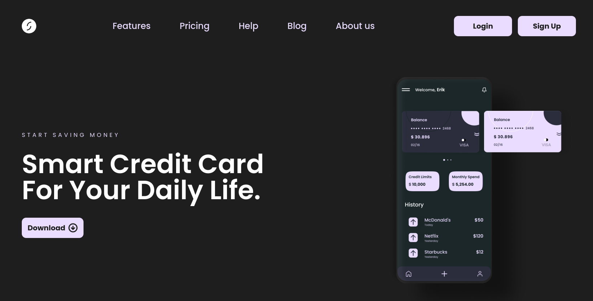

# Payment App

This is a simple landing page for a payment app website.

Tech used:

- React.js
- Tailwind CSS

Made from scratch using the figma design obtained from https://www.frontendpro.dev/

## Table of contents

- [Overview](#overview)
  - [Screenshot](#screenshot)
  - [Links](#links)
- [My process](#my-process)
  - [Built with](#built-with)
  - [What I learned](#what-i-learned)
  - [Useful resources](#useful-resources)
- [Author](#author)
- [Acknowledgments](#acknowledgments)

## Overview

### Screenshot

### Links

- Solution URL: [github](https://github.com/harrisfoes/payment-landing-page)
- Live Site URL: [here](https://harrisfoes.github.io/payment-landing-page/)

## My process

### Built with

- Semantic HTML5 markup
- CSS custom properties
- Flexbox
- Mobile-first workflow
- [React](https://reactjs.org/) - JS library
- Tailwind

### What I learned

This project has given me with a lot of firsts

- I grappled with Tailwind CSS (my first project using the resource)
- Handling overflow was a challenge
- The Hamburger Menu took a full day but hoping I could now make it quicker in the future
- First time working with mobile-first design
- First time working with a figma file

### Continued development

None. This is considered done

### Useful resources

- [Tailwind Cheatsheet](https://nerdcave.com/tailwind-cheat-sheet) - Writing in Tailwind is nigh-impossible without this

## Author

- Website - [Harris Escalante](https://harrisfoes.github.io/portfolio-page/)
- Frontend Mentor - [@harrisfoes](https://www.frontendmentor.io/profile/harrisfoes)

## Acknowledgments

I'd like to thank the good folks at frontendpro.dev for the design
